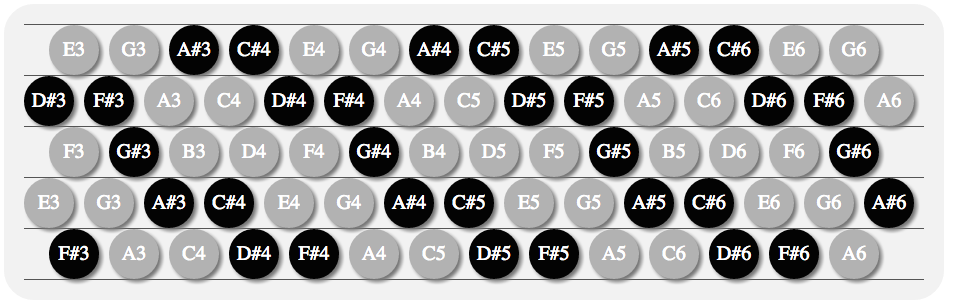
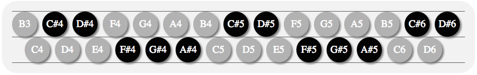

A variety of isomorphic musical keyboards, and a quiz to test note recognition.

[Live demo here](http://www.pianosnake.com/2013/11/isomorphic-keyboards-note-quiz.html)

C System keyboard example

Janko keyboard example
